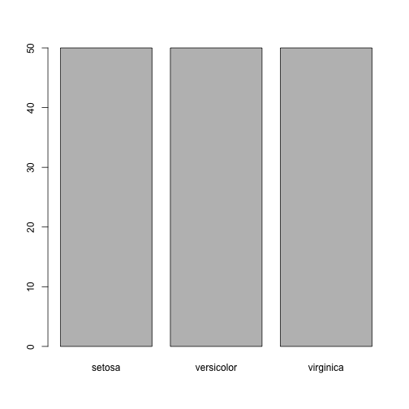
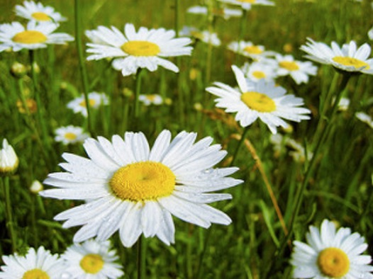

presentazione1
========================================================
author: Valentina
date: 2 May 2018
autosize: true

Prima slide
========================================================

Per maggiori dettagli sul corso potete visitare il mio sito 

<https://ww.DataWiring.me>

Ci troverete corsi e codici su 

- machine learning
- deep learning
- text mining

Slide con codice
========================================================


```r
summary(iris)
```

```
  Sepal.Length    Sepal.Width     Petal.Length    Petal.Width   
 Min.   :4.300   Min.   :2.000   Min.   :1.000   Min.   :0.100  
 1st Qu.:5.100   1st Qu.:2.800   1st Qu.:1.600   1st Qu.:0.300  
 Median :5.800   Median :3.000   Median :4.350   Median :1.300  
 Mean   :5.843   Mean   :3.057   Mean   :3.758   Mean   :1.199  
 3rd Qu.:6.400   3rd Qu.:3.300   3rd Qu.:5.100   3rd Qu.:1.800  
 Max.   :7.900   Max.   :4.400   Max.   :6.900   Max.   :2.500  
       Species  
 setosa    :50  
 versicolor:50  
 virginica :50  
                
                
                
```

Slide con grafico
========================================================



Slide con immagine
========================================================


Slide con due colonne
===============
left:40%

**Prima colonna**
- this slide has two columns
-	the first column has text
-	the second column has an image

***
**Seconda colonna**


